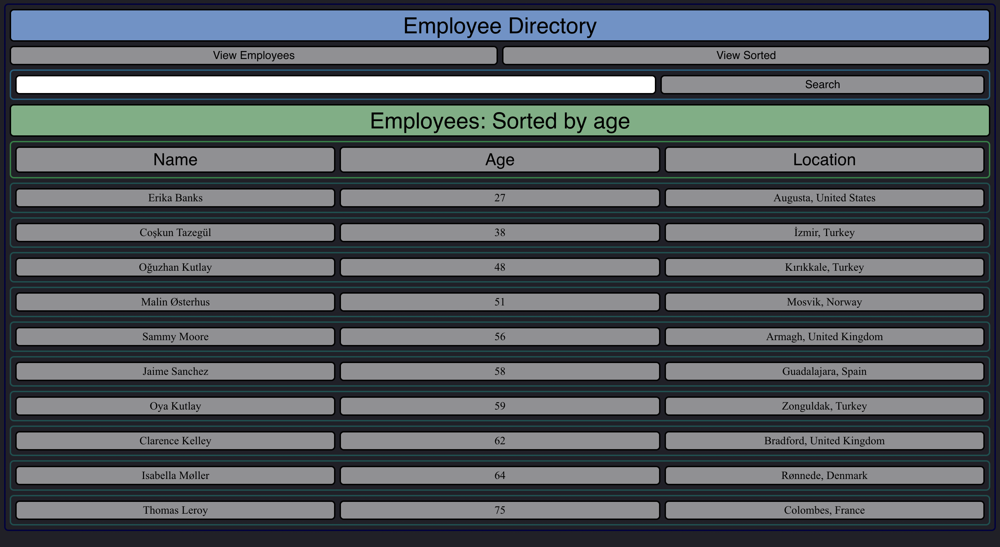
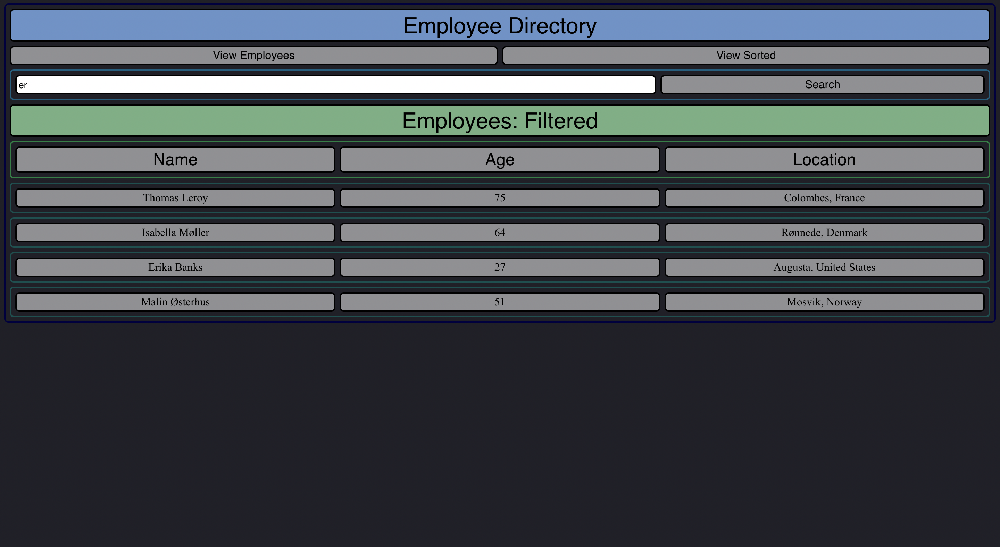

# Employee Directory

## Table of Contents
[Project Link](#Link)  
[Technologies](#Technologies)  
[Description](#Description)  
[Screenshots](#Screenshots)  
[License](#License)  
[Contact](#Contact)

## Link
https://vast-earth-63282.herokuapp.com/

## Technologies
HTML and CSS, Javascript, React, Axios, Yarn

## Description
A React webpage directory that displays a list of randomly generated employees along with their information. The list can be sorted by last name and filtered down to employees 30 years old and younger.

## Screenshots

## License
MIT

## Contact
Dalton Wilkins - daltongh@gmail.com
